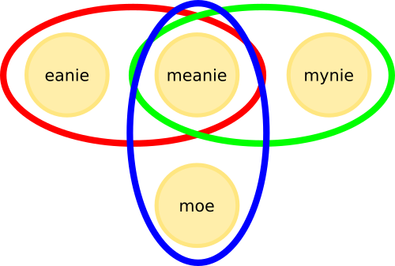

# Pipeman: a simulator of networked broadcast domains

Pipeman is a nondeterministic simulator of broadcast domains organized into networks, using simple TCP. Multiple broadcast domains can be specified in a JSON file, and the server listens for connections from ordinary TCP clients. Each `send()` event from a client gets broadcast to all the other nodes in the client's broadcast domains, optionally  with a certain chance for data loss. It's useful for experimenting with wireless mesh protocols.

Pipeman uses Goroutines to perform all the simulated asynchronous tasks. While it's not an absolute guarantee of nondeterministic runs, it's pretty close to it.

## Example

This JSON config file describes a network with three broadcast domains and four nodes:

    {
        "type": "pipeman",
        "port": 4096,
        "buffer_size": 64,
        "network": [
            {
                "name": "red",
                "nodes": ["eenie", "meanie"],
                "loss": 0
            },
            {
                "name": "green",
                "nodes": ["meanie", "mynie"],
                "loss": 0.5,
                "jitter": [100, 10]
            },
            {
                "name": "blue",
                "nodes": ["meanie", "moe"],
                "loss": 0.1
            }
        ]
    }

Here's what's happening:

* The nodes are named "eenie", "meanie", "mynie" and "moe"
* "eenie" and "meanie" are in a broadcast domain named "red", "meanie" and "mynie" are in their own broadcast domain named "green", and "meanie" and "moe" are in their own, named "blue". For example, whatever the "eenie" node sends, is received by "meanie". Note that nodes can belong to multiple domains. If the nodes (re)broadcast messages, loops are naturally possible ("broadcast storms") and there are no guards against this case.
* Domains "green" and "blue" have a certain random chance of data loss, 0.5 and 0.1 (in the range of 0 = never and 1 = always)
* Domain "green" has a 100 +/- 10 ms jitter in delivery. Jitter precision is only as good as what Go's time.Sleep() provides.

This example network can be visualised like in the following diagram:

 

## Buffer size and data loss

Data is always read and written by the server in chunks of `buffer_size`, and random data loss chance is always calculated for such a buffer before data is received by each individual node. Consider the following extreme cases:

* `buffer_size = 1` means there is a chance of data loss for every single byte, in each domain where `loss` is non-zero. It's also very inefficient.
* Setting `loss` to 0 in each domain (i.e. leaving it unconfigured), and having a large `buffer_size` (for example 16384) results in very efficient operation, but without data loss simulation.

## The protocol 

The protocol used is (currently) very simple: As soon as a node connects to the server it must send its name (case sensitive) followed by a newline. Immediately after that, it can send (and) receive whatever data it needs to.

## Command line usage

    usage: pipeman.exe [-c config.json]
    -v
            Verbose output
    -c string
            Short for config file name (default "config.json")
    -config string
            Config file name (default "config.json")

The usual command line for starting Pipeman is something like `pipeman -c config.json`.

See the `pipeman_demo.py` example in the `demo` directory for an example which uses threads to simulate multiple nodes connecting to a single Pipeman server.

## Why?

The author plans to use this to experiment with building wireless meshes on his Arduinos :)

## Example execution output

When the `pipeman_demo.py` is executed, it displays approximately the following output:

    meanie received: b'moe0\n'
    meanie received: b'eenie0\n'
    meanie received: b'mynie0\n'
    eenie received: b'meanie0\n'
    moe received: b'meanie0\n'
    meanie received: b'eenie1\n'
    meanie received: b'moe1\n'
    meanie received: b'mynie1\n'
    eenie received: b'meanie1\n'
    moe received: b'meanie1\n'
    meanie received: b'eenie2\n'
    meanie received: b'moe2\n'
    mynie received: b'meanie2\n'
    eenie received: b'meanie2\n'
    moe received: b'meanie2\n'
    meanie received: b'eenie3\n'
    meanie received: b'mynie3\n'
    eenie received: b'meanie3\n'
    moe received: b'meanie3\n'
    meanie received: b'eenie4\n'
    meanie received: b'moe4\n'
    meanie received: b'mynie4\n'
    eenie received: b'meanie4\n'
    moe received: b'meanie4\n'
    meanie received: b'eenie5\n'
    meanie received: b'moe5\n'
    meanie received: b'mynie5\n'
    eenie received: b'meanie5\n'
    moe received: b'meanie5\n'
    meanie received: b'eenie6\n'
    meanie received: b'moe6\n'
    meanie received: b'mynie6\n'
    eenie received: b'meanie6\n'
    meanie received: b'eenie7\n'
    meanie received: b'mynie7\nmoe7\n'
    eenie received: b'meanie7\n'
    moe received: b'meanie7\n'
    meanie received: b'eenie8\n'
    meanie received: b'moe8\n'
    exit eenie
    exit moe
    exit mynie
    exit meanie

On the Pipeman server side, when the Verbose option is turned on, the output is something like the following:

    2016/08/27 14:21:12 moe sent 5 bytes ; fanning out to 1 domains
    2016/08/27 14:21:12 eenie sent 7 bytes ; fanning out to 1 domains
    2016/08/27 14:21:12 mynie sent 7 bytes ; fanning out to 1 domains
    2016/08/27 14:21:12 meanie sent 8 bytes ; fanning out to 3 domains
    2016/08/27 14:21:12 Lost 8 bytes in delivery to mynie
    2016/08/27 14:21:12 Sleeping 96 ms before delivering 7 bytes to meanie
    2016/08/27 14:21:13 eenie sent 7 bytes ; fanning out to 1 domains
    2016/08/27 14:21:13 moe sent 5 bytes ; fanning out to 1 domains
    2016/08/27 14:21:13 mynie sent 7 bytes ; fanning out to 1 domains
    2016/08/27 14:21:13 meanie sent 8 bytes ; fanning out to 3 domains
    2016/08/27 14:21:13 Sleeping 107 ms before delivering 7 bytes to meanie
    2016/08/27 14:21:14 eenie sent 7 bytes ; fanning out to 1 domains
    2016/08/27 14:21:14 mynie sent 7 bytes ; fanning out to 1 domains
    2016/08/27 14:21:14 Lost 7 bytes in delivery to meanie
    2016/08/27 14:21:14 Sleeping 103 ms before delivering 8 bytes to mynie
    2016/08/27 14:21:14 moe sent 5 bytes ; fanning out to 1 domains
    2016/08/27 14:21:14 meanie sent 8 bytes ; fanning out to 3 domains
    2016/08/27 14:21:14 Lost 8 bytes in delivery to mynie
    2016/08/27 14:21:15 eenie sent 7 bytes ; fanning out to 1 domains
    2016/08/27 14:21:15 moe sent 5 bytes ; fanning out to 1 domains
    2016/08/27 14:21:15 Lost 5 bytes in delivery to meanie
    2016/08/27 14:21:15 mynie sent 7 bytes ; fanning out to 1 domains
    2016/08/27 14:21:15 meanie sent 8 bytes ; fanning out to 3 domains
    2016/08/27 14:21:15 Sleeping 108 ms before delivering 7 bytes to meanie
    2016/08/27 14:21:15 Lost 8 bytes in delivery to mynie
    2016/08/27 14:21:16 eenie sent 7 bytes ; fanning out to 1 domains
    2016/08/27 14:21:16 moe sent 5 bytes ; fanning out to 1 domains
    2016/08/27 14:21:16 mynie sent 7 bytes ; fanning out to 1 domains
    2016/08/27 14:21:16 meanie sent 8 bytes ; fanning out to 3 domains
    2016/08/27 14:21:16 Lost 8 bytes in delivery to mynie
    2016/08/27 14:21:16 Sleeping 93 ms before delivering 7 bytes to meanie
    2016/08/27 14:21:17 eenie sent 7 bytes ; fanning out to 1 domains
    2016/08/27 14:21:17 moe sent 5 bytes ; fanning out to 1 domains
    2016/08/27 14:21:17 mynie sent 7 bytes ; fanning out to 1 domains
    2016/08/27 14:21:17 meanie sent 8 bytes ; fanning out to 3 domains
    2016/08/27 14:21:17 Lost 8 bytes in delivery to mynie
    2016/08/27 14:21:17 Sleeping 97 ms before delivering 7 bytes to meanie
    2016/08/27 14:21:18 eenie sent 7 bytes ; fanning out to 1 domains
    2016/08/27 14:21:18 moe sent 5 bytes ; fanning out to 1 domains
    2016/08/27 14:21:18 mynie sent 7 bytes ; fanning out to 1 domains
    2016/08/27 14:21:18 meanie sent 8 bytes ; fanning out to 3 domains
    2016/08/27 14:21:18 Lost 8 bytes in delivery to mynie
    2016/08/27 14:21:18 Lost 8 bytes in delivery to moe
    2016/08/27 14:21:18 Sleeping 92 ms before delivering 7 bytes to meanie
    2016/08/27 14:21:19 eenie sent 7 bytes ; fanning out to 1 domains
    2016/08/27 14:21:19 mynie sent 7 bytes ; fanning out to 1 domains
    2016/08/27 14:21:19 moe sent 5 bytes ; fanning out to 1 domains
    2016/08/27 14:21:20 meanie sent 8 bytes ; fanning out to 3 domains
    2016/08/27 14:21:20 Sleeping 101 ms before delivering 7 bytes to meanie
    2016/08/27 14:21:20 Lost 8 bytes in delivery to mynie
    2016/08/27 14:21:20 eenie sent 7 bytes ; fanning out to 1 domains
    2016/08/27 14:21:20 moe sent 5 bytes ; fanning out to 1 domains
    2016/08/27 14:21:20 mynie sent 7 bytes ; fanning out to 1 domains
    2016/08/27 14:21:20 Lost 7 bytes in delivery to meanie
    2016/08/27 14:21:21 meanie sent 8 bytes ; fanning out to 3 domains
    2016/08/27 14:21:21 Lost 8 bytes in delivery to mynie
    2016/08/27 14:21:21 eenie sent 7 bytes ; fanning out to 1 domains
    2016/08/27 14:21:21 Error reading connection eenie read tcp [::1]:4096->[::1]:64491: wsarecv: An existing connection was forcibly closed by the remote host.
    2016/08/27 14:21:21 mynie sent 7 bytes ; fanning out to 1 domains
    2016/08/27 14:21:21 Node has disconnected: mynie
    2016/08/27 14:21:21 moe sent 5 bytes ; fanning out to 1 domains
    2016/08/27 14:21:21 Error reading connection moe read tcp [::1]:4096->[::1]:64493: wsarecv: An established connection was aborted by the software in your host machine.
    2016/08/27 14:21:22 meanie sent 8 bytes ; fanning out to 3 domains
    2016/08/27 14:21:22 Error reading connection meanie read tcp [::1]:4096->[::1]:64490: wsarecv: An existing connection was forcibly closed by the remote host.
    2016/08/27 14:21:22 Error reading connection: meanie write tcp [::1]:4096->[::1]:64490: wsasend: An existing connection was forcibly closed by the remote host.

## License

Copyright (c) 2016, Ivan Voras <ivoras@gmail.com>
All rights reserved.

Redistribution and use in source and binary forms, with or without modification, are permitted provided that the following conditions are met:

1. Redistributions of source code must retain the above copyright notice, this list of conditions and the following disclaimer.
2. Redistributions in binary form must reproduce the above copyright notice, this list of conditions and the following disclaimer in the documentation and/or other materials provided with the distribution.

THIS SOFTWARE IS PROVIDED BY THE COPYRIGHT HOLDERS AND CONTRIBUTORS "AS IS" AND ANY EXPRESS OR IMPLIED WARRANTIES, INCLUDING, BUT NOT LIMITED TO, THE IMPLIED WARRANTIES OF MERCHANTABILITY AND FITNESS FOR A PARTICULAR PURPOSE ARE DISCLAIMED. IN NO EVENT SHALL THE COPYRIGHT HOLDER OR CONTRIBUTORS BE LIABLE FOR ANY DIRECT, INDIRECT, INCIDENTAL, SPECIAL, EXEMPLARY, OR CONSEQUENTIAL DAMAGES (INCLUDING, BUT NOT LIMITED TO, PROCUREMENT OF SUBSTITUTE GOODS OR SERVICES; LOSS OF USE, DATA, OR PROFITS; OR BUSINESS INTERRUPTION) HOWEVER CAUSED AND ON ANY THEORY OF LIABILITY, WHETHER IN CONTRACT, STRICT LIABILITY, OR TORT (INCLUDING NEGLIGENCE OR OTHERWISE) ARISING IN ANY WAY OUT OF THE USE OF THIS SOFTWARE, EVEN IF ADVISED OF THE POSSIBILITY OF SUCH DAMAGE.